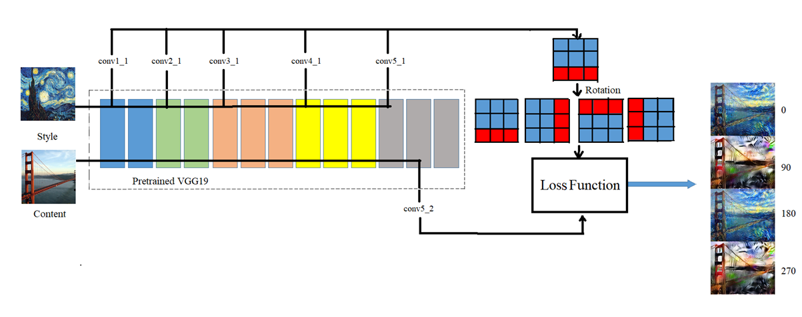
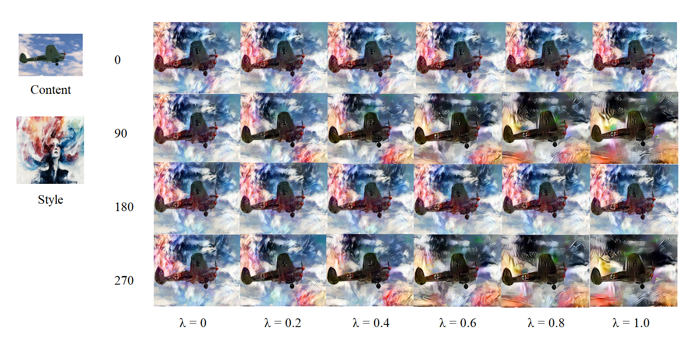
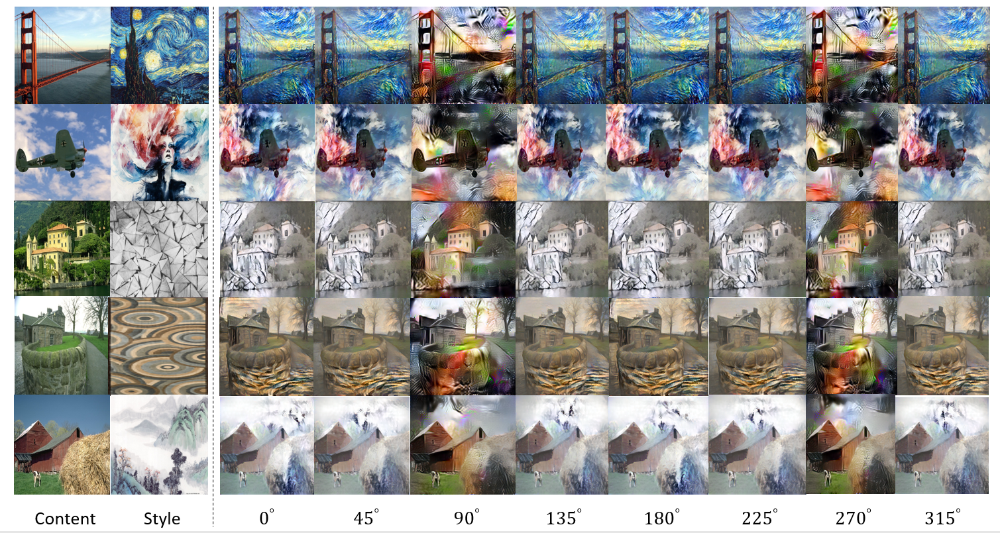

# Deep Feature Rotation for Multimodal Image Style Transfer


[]((https://github.com/sonnguyen129/deep-feature-rotation/graphs/commit-activity))


--------------------------------

This repository contains the **official implementation** of paper: <br>
[***Deep Feature Rotation for Multimodal Image Style Transfer***](https://drive.google.com/file/d/10PlfQGgqGja60zWoXHrU-9obZCac0IEK/view?usp=sharing) <br>
[**Son Truong Nguyen**](https://sonnguyen129.github.io/), Nguyen Quang Tuyen, Nguyen Hong Phuc <br>
In [**NICS 2021**](http://nafosted-nics.org/) **Oral**.<br>

| [Paper](https://drive.google.com/file/d/10PlfQGgqGja60zWoXHrU-9obZCac0IEK/view?usp=sharing) | [Presentation](https://docs.google.com/presentation/d/1QmEaNGX28uZUJ_Gy-NqIWW0nPcdlqrAA/edit?usp=sharing&ouid=103577362269285208414&rtpof=true&sd=true) | [Colab Demo](#demo) | Bibtex |
| :---:     |  :----: | :---: |  :---: |
    
## Table of Content

1. [Overview](#overview)
1. [Getting Started](#getting-started)
    - [Demo](#demo)
    - [Installation](#installation)
3. [Results](#results)
4. [Extensive results](#extensive-results)
5. [Contact](#contact)

## Overview
We propose a simple method for representing style features in many ways called ***Deep Feature Rotation (DFR)***, while still achieving effective stylization compared to more complex methods in style transfer. Our approach is a representative of the many ways of augmentation for intermediate feature embedding without consuming too much computational expense.



## Getting started
### Demo
<p align="center">
    <a href="https://colab.research.google.com/drive/1nmf4_YnUBq5dGGTgWeN1fYNYOSOKeQ-1?usp=sharing">
    
    </a>
        <br>
    Try out in Google Colab
</p>

### Installation
* Clone this repository and check the ```requirements.txt```:
    ```shell
    git clone https://github.com/sonnguyen129/deep-feature-rotation
    cd deep-feature-rotation
    pip install -r requirements.txt
    ```
* Inference:
    * Prepare your content image and style image. I provide some in the ```data/content``` and ```data/style``` and you can try to use them easily.
    * Simply run: 
    
    ```shell
    python train.py --content-path <CONTENT_PATH> --style-path <STYLE_PATH>
    ```
    
    The test results will be saved to ```./results``` by default.

## Results
*Experimental result in different rotation weight*


--------------
*Comparison with other methods*


## Extensive results
We provide a visual comparison between other rotation angles that do not appear in the paper. The rotation angles will produce a very diverse number of outputs. This has proven the effectiveness of our method with other methods.



<div align="center"><em><strong>Table 1:</strong> Visual comparison in different rotation angles</em></div>


## Contact
If you have any questions/comments/bug reports, feel free to open a github issue or pull a request or mail to the author Son Truong Nguyen.

