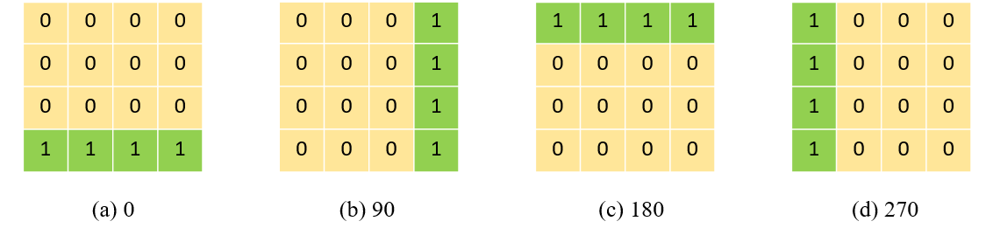

# Deep Feature Rotation for Multimodal Image Style Transfer
Run [this notebook](https://github.com/sonnguyen129/style-transfer-rotation/blob/main/Style_transfer_rotation.ipynb) or [Colab](https://colab.research.google.com/drive/1nmf4_YnUBq5dGGTgWeN1fYNYOSOKeQ-1?usp=sharing) to see results
## Overview
We propose a simple method for representing style features in many ways called Deep Feature Rotation, while still achieving effective stylization compared to more complex methods in style transfer. Our approach is a representative of the many ways of augmentation for intermediate feature embedding without consuming too much computational expense.

