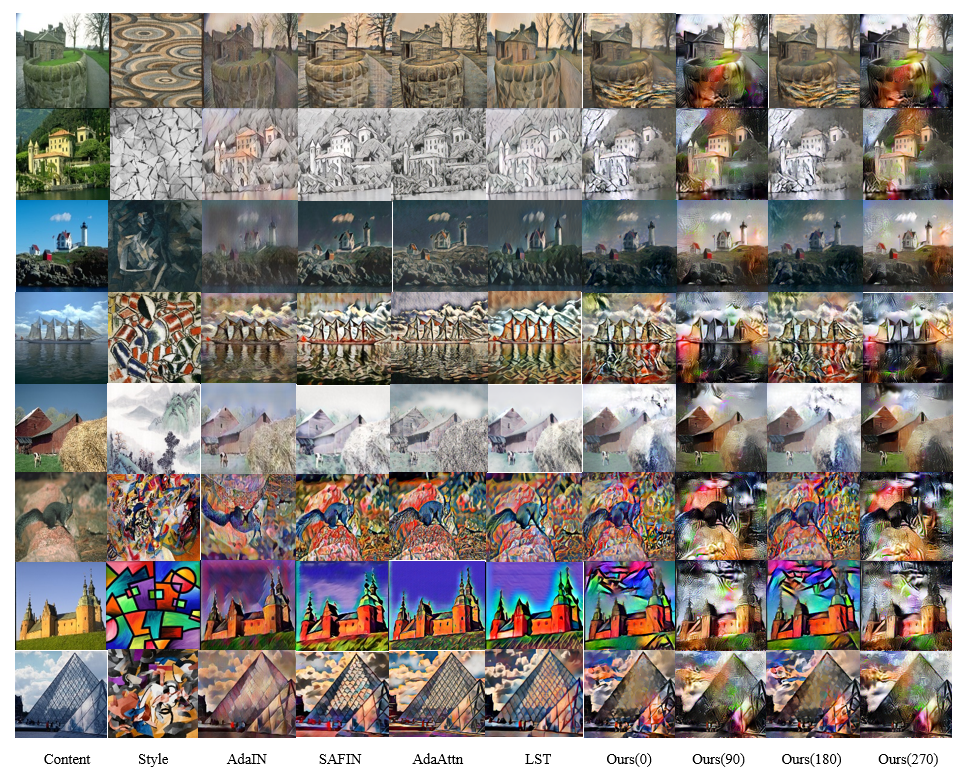

# Deep Feature Rotation for Multimodal Image Style Transfer

## Overview
We propose a simple method for representing style features in many ways called Deep Feature Rotation, while still achieving effective stylization compared to more complex methods in style transfer. Our approach is a representative of the many ways of augmentation for intermediate feature embedding without consuming too much computational expense.


## Getting started
* Clone this repository:
    ```
    git clone https://github.com/sonnguyen129/style-transfer-rotation
    cd style-transfer-rotation
    ```
* Inference:

    * Simply run and check the results under ```results/``` folder
    
    ```
    cd style-transfer
    python train.py --content-path <CONTENT_PATH> --style-path <STYLE_PATH>
    ```
    
    
    * <p align="left">
        <a href="https://colab.research.google.com/drive/1nmf4_YnUBq5dGGTgWeN1fYNYOSOKeQ-1?usp=sharing">
        
        </a>
            <br>
        Try out in Google Colab
      </p>

## Result
Experimental Result in different rotation weight


Comparison with other methods



